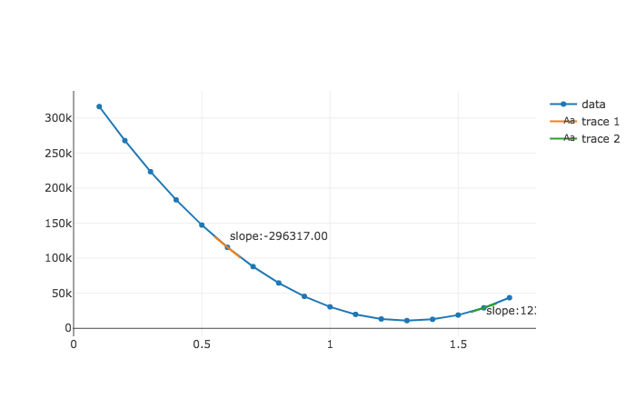

# Gradient Descent Step Sizes Lab

### Introduction

In this lab, we'll practice applying gradient descent.  As we know gradient descent begins with an initial regression line, and moves to a "best fit" regression line by changing values of $m$ and $b$ and evaluating the RSS.  So far, we have illustrated this technique by changing the values of $b$ and evaluating the RSS.  In this lab, we will work through applying our technique by changing the value of $m$ instead.  Let's get started.

### Setting up our initial regression line

Once again, we'll take take a look at revenues of movies to predict revenue. 


```python
first_show = {'budget': 100, 'revenue': 275}
second_show = {'budget': 200, 'revenue': 300}
third_show = {'budget': 400, 'revenue': 700}

shows = [first_show, second_show, third_show]
```

We can start with some values for an initial not-so-accurate regression line, $y = .6x + 133.33$.


```python
from linear_equations import build_regression_line

budgets = list(map(lambda show: show['budget'], shows))
revenues = list(map(lambda show: show['revenue'], shows))
```


```python
def regression_line(x):
    return .6*x + 133.33
```

Now using the `residual_sum_squares`, function, we calculate the RSS to measure the accuracy of the regression line to our data.  Let's take another look at that function:


```python
def squared_error(x, y, m, b):
    return (y - (m*x + b))**2

def residual_sum_squares(x_values, y_values, m, b):
    data_points = list(zip(x_values, y_values))
    squared_errors = map(lambda data_point: squared_error(data_point[0], data_point[1], m, b), data_points)
    return sum(squared_errors)
```


```python
from plotly.offline import iplot, init_notebook_mode
from graph import plot, m_b_trace
import plotly.graph_objs as go

init_notebook_mode(connected=True)

from graph import trace_values, plot

data_trace = trace_values(budgets, revenues)
regression_trace = m_b_trace(.6, 133.33, budgets)
plot([data_trace, regression_trace])
```

### Building a cost curve

Now let's use the `residual_sum_squares` function to build a cost curve.  Keeping the $b$ value fixed at $133.33$, write a function called `rss_values`.  
* `rss_values` passes our dataset with the `x_values` and `y_values` arguments.  
* It also takes a list of values of $m$, and an initial $b$ value as arguments.  
* It outputs a dictionary with keys of `m_values` and `rss_values`, with each key pointing to a list of the corresponding values.


```python
def rss_values(x_values, y_values, m_values, b):
    pass
```


```python
budgets = list(map(lambda show: show['budget'] ,shows))
revenues = list(map(lambda show: show['revenue'] ,shows))
initial_m_values = list(range(8, 19, 1))
scaled_m_values = list(map(lambda initial_m_value: initial_m_value/10,initial_m_values))
b_value = 133.33
rss_values(budgets, revenues, scaled_m_values, b_value)

# {'m_values': [0.8, 0.9, 1.0, 1.1, 1.2, 1.3, 1.4, 1.5, 1.6, 1.7, 1.8],
#  'rss_values': [64693.76669999998,
#   45559.96669999998,
#   30626.166699999987,
#   19892.36669999999,
#   13358.5667,
#   11024.766700000004,
#   12890.96670000001,
#   18957.166700000016,
#   29223.36670000002,
#   43689.566700000025,
#   62355.76670000004]}

```

Plotly provides for us a table chart, and we can pass the values generated from our `rss_values` function to create a table.


```python
from plotly.offline import iplot, init_notebook_mode
from graph import plot
import plotly.graph_objs as go

init_notebook_mode(connected=True)

def plot_table(headers, columns):
    trace_cost_chart = go.Table(
        header=dict(values=headers,
                    line = dict(color='#7D7F80'),
                    fill = dict(color='#a1c3d1'),
                    align = ['left'] * 5),
        cells=dict(values=columns,
                   line = dict(color='#7D7F80'),
                   fill = dict(color='#EDFAFF'),
                   align = ['left'] * 5))
    plot([trace_cost_chart])
```


```python
cost_chart = rss_values(budgets, revenues, scaled_m_values, b_value)
if cost_chart: 
    column_values = list(cost_chart.values())
    plot_table(headers = ['M values', 'RSS values'], columns=column_values)
```

And let's plot this out using a a line chart.


```python
from plotly.offline import iplot, init_notebook_mode
init_notebook_mode(connected=True)
from graph import plot, trace_values

initial_m_values = list(range(1, 18, 1))
scaled_m_values = list(map(lambda initial_m_value: initial_m_value/10,initial_m_values))
cost_values = rss_values(budgets, revenues, scaled_m_values, 133.33)

if cost_values:
    rss_trace = trace_values(cost_values['m_values'], cost_values['rss_values'], mode = 'lines')
    plot([rss_trace])
```

### Looking at the slope of our cost curve

In this section, we'll work up to building a gradient descent function that automatically changes our step size.  To get you started, we'll provide a function called `slope_at` that calculates the slope of the cost curve at a given point on the cost curve.  Here it is in action:


```python
from helper import slope_at
```


```python
slope_at(budgets, revenues, .6, 133.33333333333326)
```


```python
slope_at(budgets, revenues, 1.6, 133.33333333333326)
```

So the `slope_at` function takes in our dataset, and returns the slope of the cost curve at that point.  So the numbers -296312 and 123877 reflect the slopes at the cost curve when m is .6 and 1.6 respectively.



As you can see, it seems pretty accurate.  When the curve is steeper and downwards at $m = 6$, the slope is around -290,000.  And at $m = 1.3$ with our cost curve pointing upwards yet flatter, our slope is around 120,000. 

### Moving towards gradient descent

Now that we are familiar with our `slope_at` function and how it calculates the slope of our cost curve at a given point, we can begin to use that function with our gradient descent procedure.

Remember that gradient descent works by starting at a regression line with values m, and b, which corresponds to a point on our cost curve.  Then we alter our m or b value (here, the m value) by looking to the slope of the cost curve at that point.  Then we look to the slope of the cost curve at the new m value to indicate the size and direction of the next step.

So now let's write a function called `updated_m`.  The function will tell us the step size and direction to move along our cost curve.  The `updated_m` function takes as arguments an initial value of $m$, a learning rate, and the `slope` of the cost curve at that value of $m$.  Its return value is the next value of `m` that it calculates.


```python
from error import residual_sum_squares

def updated_m(m, learning_rate, cost_curve_slope):
    pass
```

This is what our function returns.


```python
current_slope = slope_at(budgets, revenues, 1.7, 133.33333333333326)['slope']
updated_m(1.7, .000001, current_slope)
# 1.5343123333335096

current_slope = slope_at(budgets, revenues, 1.534, 133.33333333333326)['slope']
updated_m(1.534, .000001, current_slope)
# 1.43803233333338

current_slope = slope_at(budgets, revenues, 1.438, 133.33333333333326)['slope']
updated_m(1.438, .000001, current_slope)
# 1.3823523333332086
```

Take a careful look at how we use the `updated_m` function.  By using our updated value of $m$ we are quickly converging towards an optimal value of $m$.   

Now let's write another function called `gradient_descent`.  The inputs of the function are `x_values`, `y_values`, `steps`, the `b` we are holding constant, the `learning_rate`, and the `current_m` that we are looking at.  The `steps` arguments represents the number of steps the function will take before the function stops.  We can get a sense of the return value in the cell below.  It is a list of dictionaries, with each dictionary having a key of the current `m` value, the `slope` of the cost curve at that m value, and the `rss` at that m value.


```python
def gradient_descent(x_values, y_values, steps, b, learning_rate, current_m):
    pass
```


```python
descent_steps = gradient_descent(budgets, revenues, 12, 133.33, learning_rate = .000001, current_m = 0)
descent_steps

# [{'m': 0, 'rss': 368964.16669999994, 'slope': -548316.9999998063},
#  {'m': 0.5483169999998062, 'rss': 131437.9413767516, 'slope': -318023.86000024853},
#  {'m': 0.8663408600000547,  'rss': 51531.31420747324, 'slope': -184453.83880040026}, 
#  {'m': 1.050794698800455,  'rss': 24649.097944855268,  'slope': -106983.22650372575},
#  {'m': 1.1577779253041809,  'rss': 15604.976802103287,  'slope': -62050.271372208954},
#  {'m': 1.2198281966763898,  'rss': 12561.987166284125,  'slope': -35989.15739588847},
#  {'m': 1.2558173540722781,  'rss': 11538.008028425651, 'slope': -20873.711289696075},
#  {'m': 1.2766910653619743,  'rss': 11193.357340315255,  'slope': -12106.752547970245},
#  {'m': 1.2887978179099446,  'rss': 11077.310067278091,  'slope': -7021.916477824561},
#  {'m': 1.295819734387769,  'rss': 11038.209831325046,  'slope': -4072.711557128059},
#  {'m': 1.299892445944897,  'rss': 11025.020590634533,  'slope': -2362.172703124088},
#  {'m': 1.302254618648021,  'rss': 11020.562895703,  'slope': -1370.0601677373925}]
```


```python
if descent_steps:
    m_values = list(map(lambda step: step['m'],descent_steps))
    rss_result_values = list(map(lambda step: step['rss'], descent_steps))
    text_values = list(map(lambda step: 'cost curve slope: ' + str(step['slope']), descent_steps))
    gradient_trace = trace_values(m_values, rss_result_values, text=text_values)
    plot([gradient_trace])
```

Taking a look at a plot of our trace, you can get a nice visualization of how our gradient descent function works.  It starts far away with $m = 0$, and the step size is relatively large, as is the slope of the cost curve.  As the $m$ value updates such that it approaches a minimum of the RSS, the slope of the cost curve and the size of each step both decrease.     

Remember that each of these steps indicates a change in our regression line's slope value towards a "fit" that more accurately matches our dataset.  Let's plot these various regression lines below, starting with our slope at 0 and moving from there.  


```python
from plotly.offline import iplot, init_notebook_mode
from graph import plot, m_b_trace
import plotly.graph_objs as go

init_notebook_mode(connected=True)

from graph import trace_values, plot

data_trace = trace_values(budgets, revenues)
if descent_steps:
    m_values = list(map(lambda step: step['m'] ,descent_steps))
    regression_traces = list(map(lambda m: m_b_trace(m, 133.33, budgets, name = 'm:' + str(round(m, 2))), m_values))
    plot([data_trace, *regression_traces])
```

As you can see the slope converges towards a slope that better matches our data, around m = 1.3.  You can isolate how the line changes clicking on the names of the lines to the right, which toggles the display of the respective lines.

### Summary

In this lesson, we learned some more about gradient descent.  We saw how gradient descent allows our function to improve to a regression line that better matches our data.  We see how to change our regression line, by looking at the Residual Sum of Squares related to current regression line. We update our regression line by looking at the rate of change of our RSS as we adjust our regression line in the right direction -- that is, the slope of our cost curve.  The larger the magnitude of our rate of change (or slope of our cost curve) the larger our step size.  This way, we take larger steps the further away we are from our minimizing our RSS, and take smaller steps as we converge towards our minimum RSS. 
